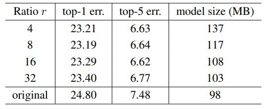
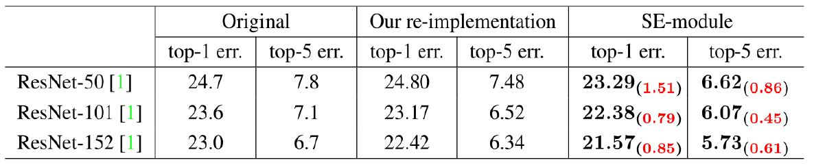
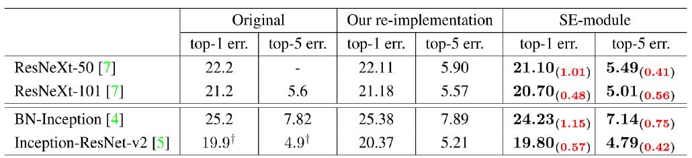
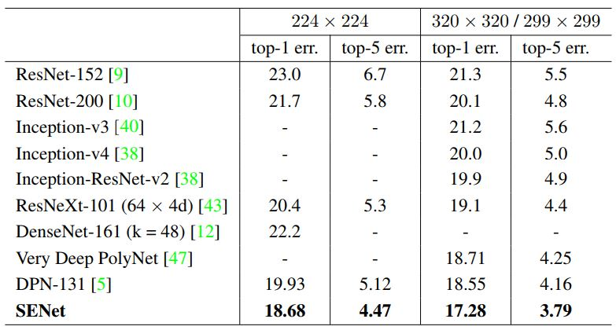

# SENet-Tensorflow
Simple Tensorflow implementation of ****** using **Cifar10** 

I implemented the following SENet
* 
* 

If you want to see the ***original author's code***, please refer to this [link](https://github.com/hujie-frank/SENet)

## Requirements
* Tensorflow 1.x
* Python 3.x
* tflearn (If you are easy to use ***global average pooling***, you should install ***tflearn***)

## What is the "SE block" ?

## How apply ? (Inception, Residual)

   
  

## How "Reduction ratio" should I set?

* **original** refers to ***ResNet-50***

## Benefits against Network Depth

## Incorporation with Modern Architecture

## Comparison with State-of-the-art

## Related works
* [Densenet](https://github.com/taki0112/Densenet-Tensorflow)
* [ResNeXt](https://github.com/taki0112/ResNeXt-Tensorflow)

## Reference
* [Inception_korean](https://norman3.github.io/papers/docs/google_inception.html)

## Author
Junho Kim
